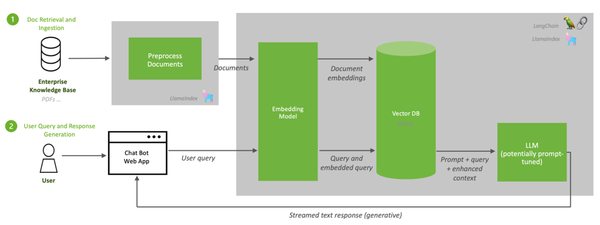

### Expanding LLM Knowledge: Understanding Retrieval Augmented Generation (RAG)
When considering how to provide a Large Language Model (LLM) with **additional knowledge**, there are generally two primary options: **in-context learning** or **RAG technology**. While other methods like fine-tuning exist, **RAG technology** is considered the **best and easiest way** to give LLMs additional knowledge, being much more **efficient and faster** compared to fine-tuning.

### The Need for RAG Technology: Context Window Limitations

A fundamental challenge when expanding an LLM's knowledge is the **context window limitation**. The context window is where the LLM processes and understands the current conversation or prompt. If you attempt to provide too much context or upload a vast amount of documents, the **token limit will be reached**. Once too many tokens are inside the context window, the LLM will no longer understand what you are talking about, making it impractical to directly feed "a gazillion PDFs" into the prompt.

### Understanding Retrieval Augmented Generation (RAG) Technology

**RAG technology** allows an LLM to dynamically access and search information from uploaded files, overcoming context window limitations and effectively providing additional, up-to-date knowledge. This approach enables the LLM to simply browse and search every single thing out of an uploaded file, such as a PDF.

#### Core Components of RAG Technology: Embeddings and Vector Databases

The entire RAG process relies on two crucial components: **embeddings models** and **vector databases**.

*   **Files and Documents**: The process begins with your raw data, which can be various formats like PDFs or CSVs.
*   **Embeddings Models**: These models are responsible for transforming raw data into a numerical format (vectors or embeddings) that LLMs can understand and process for semantic similarity.
*   **Vector Database**: This is where the processed numerical data (vectors/embeddings) is stored. A vector database is typically **three-dimensional** in concept and offers a large amount of space for storing these embeddings.

#### How Embeddings Work

1.  **Transformation to Vectors**: When files are uploaded, an **embeddings model** converts their content into **vectors**, which are essentially lists of **numbers** (e.g., 0.2, 1.2). The embeddings model creates these vectors so they make sense.
2.  **Semantic Meaning and Clustering**: The purpose of these vectors is to represent the meaning of words and concepts. Words that are **semantically similar** will have numerically similar embeddings and thus be "close" to each other in the vector space. For example, "apple" will have a similar embedding to "banana," while "wolf," "dog," and "cat" will have different embeddings. The embeddings model creates **clusters** of words or concepts based on their numerical proximity, such as a cluster for fruits, another for animals, or even prices. These clusters are stored in the vector database in a way that is logical for the LLM.
3.  **Storage in Vector Database**: These clustered vectors are then stored in the vector database in small portions, utilizing its large storage capacity.

**Analogy of a Party/Club**: To illustrate how the vector database works, consider a party or club.
*   Different **clusters** of people (representing embeddings) gather in different areas. For example, "drunk guys" at the bar, "girls having fun" on the dance floor, and "AI nerds" watching a course.
*   Just as a parent would know to search for their daughter on the dance floor (and not with the drunk guys or AI nerds), the LLM knows **exactly where to search** in the vector database for relevant information based on the query's semantic meaning. If you ask about "bananas," the LLM will search the "banana space" or "fruit embeddings" within the database; similarly, for animals, it searches relevant animal vectors.

#### The RAG Process Flow and LLM Decision Making

The process of **RAG technology** involves several steps:

1.  **Document Ingestion**: You upload your documents (e.g., PDFs, CSVs).
2.  **Chunking and Embedding**: These documents are first **chunked** into smaller pieces, and then an **embeddings model** converts these chunks into vectors (embeddings).
3.  **Vector Database Storage**: The resulting vectors are stored in the **vector database**.
4.  **User Query**: A user asks a question or provides a query to the LLM.

When a user query comes into the LLM, the LLM makes a crucial decision:
*   **Known Answer**: If the LLM already **knows the answer** to the query (i.e., the answer is within its original training data and does not require external information), it will provide the answer directly without searching the vector database.
*   **Unknown Answer (Function Calling)**: If the LLM **does not know the answer** or determines that external information is needed, it will then perform a **function call** to search the vector database. This is a critical point where the concept of **function calling** connects: the LLM leverages this capability to "query or search the vector database if it's needed". If the answer is already known and the vector database is not required, the LLM will not perform function calling for that particular query. This is referred to as "function calling with **RAG technology**".

#### Retrieving and Presenting Information

1.  **Similarity Search**: When the LLM queries the vector database, it performs a **similarity search**. This means it looks for sentences or chunks in the database that are semantically most similar to the user's query.
2.  **Top-K Results**: The vector database returns the **most relevant documents or chunks**, which are known as **top-k results**. The `k` value determines the number of relevant chunks that are retrieved (e.g., `k=2` means two chunks, `k=8` means eight chunks).
3.  **Chunk Size**: Each returned chunk has a specific length, adjustable by the **chunking size** parameter (e.g., 500 tokens, 5000 tokens).
4.  **Contextualized Answer**: These retrieved chunks are then fed back into the LLM. The LLM uses this newly retrieved context to structure one last time sentences that make sense and bring the answer back to the user.

This dynamic retrieval process ensures that the LLM accesses only the most relevant information, making **RAG technology** a highly effective and efficient method for expanding LLM knowledge.
